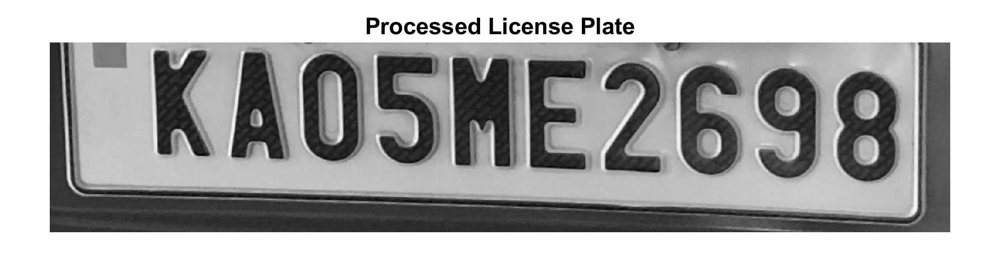

## Automatic License Plate Recognition

The Automatic License Plate Recognition project, developed in MATLAB, automates the detection and recognition of vehicle license plates using image processing techniques. The Algorithm locates the license plate by applying an edge filter followed by an edge histogram count to identify the plate region precisely. Character recognition utilizes template matching, where each character is compared against predefined templates and the closest match is selected as the recognized character. This process, which includes steps like image preprocessing, plate localization, and character recognition, is optimized for applications such as traffic management, parking systems, toll booths, and surveillance, offering an efficient solution for vehicle identification.

